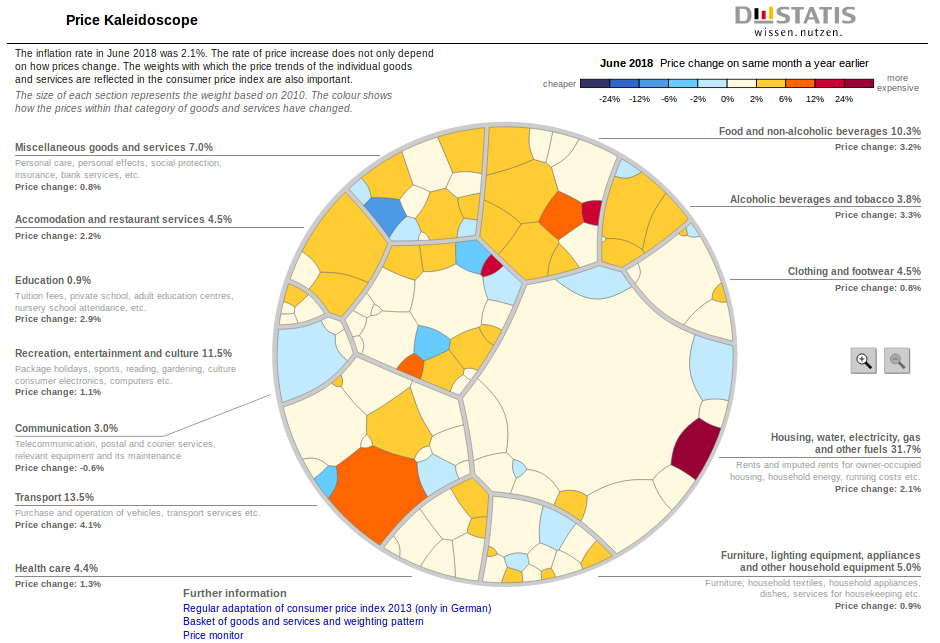

```{r setup, include=FALSE} 
knitr::opts_chunk$set(echo = FALSE)
```

```{r warning=FALSE, message=FALSE}

library(shiny)
library(shinydashboard)
library(dplyr)
library(DT)
library(plotly)
library(ggplot2)
library(openxlsx)
library(treemap)
library(gridBase)

datafiles <- readRDS("./data/choices.RDS")
cpi <- readRDS('./data/cpi.RDS')
weights <- readRDS("./data/weights.RDS")
weights1 <- readRDS("./data/weights1.RDS")
treeplots<-readRDS("./data/treemap.RDS")

```
## Executive Summary 


- Objective of the Shiny app
- Shiny app structure
- Sharing and hosting 
- Moving forward
- Questions


## Objective of the Shiny app 
<br>
<br>
The <span style="color:blue">**Consumer Price Index (CPI)**</span> dashboard aims to provide users a friendly graphic tool that can be used to compare the evolution of the prices of the 282 items of the basket of goods and services. 

## Objective of the Shiny app 

The shiny application enables users:

- to select and download CPI data from 3 different datasets. 

- to visualize a hover plot to compare the evolution of prices of the 282 items.

- to compare the percentage contribution of these items to the overall CPI. 

- to find the Canadian dollar value of a given year in terms of another year.


## Consumer Price Index


```{r }

#Plots
ui <- fluidPage(
   sidebarLayout(
     sidebarPanel(
       selectInput('dataset', 'Choose Dataset', 
                   choices = c("Monthly CPI" = "1", "Month over month CPI growth" = "2",
                               "Year over year CPI growth (monthly change)" = "3", 
                               "Yearly CPI" = "4", "Year over year CPI growth" = "5")),
       uiOutput("item"),
       uiOutput("date"),
       uiOutput("geo"),
       selectInput("graphType", "Type of Chart:", choices = list("Line Chart", 
                                                                 "Scatter Plot"), 
                   selected = "Line Chart"),
       selectInput("showTable", "Show Data As:", choices = list("Chart", "Table", "Both"),
                   selected = "Both"),
       downloadButton('export', 'Download')),
     
     mainPanel(
       conditionalPanel(
         condition = "input.showTable != 'Table'",
         box(  width = NULL, plotlyOutput("lineChart",height="400px"), collapsible = TRUE,
               status = "primary", solidHeader = TRUE)),
       conditionalPanel(
         condition = "input.showTable != 'Chart'",
         box(  width = NULL, DTOutput("tbl",height="500px"), collapsible = FALSE,
               status = "primary", solidHeader = TRUE)))
  )
)

server = function(input,output,session){   
 outVar <- reactive({
    temp <- datafiles[[as.numeric(input$dataset)]]
  })
  
  output$item <- renderUI({
    selectInput("item","CPI Item(s):",
                choices = unique(outVar()$Item),
                multiple = TRUE,
                selected = 'All-items'
    )
  })
  
  output$geo <- renderUI({
    selectInput("geo", "Region(s):", choices = unique(outVar()$Region),
                multiple=TRUE,
                selected = 'CAN')
  })
    
  filters1 <- reactive({
    check <- outVar() %>%
      filter(Region %in% input$geo,
             Item %in% input$item
      )
  })
  
  output$date <- renderUI({
    if (is.null(input$item)){return()}
    if (is.null(input$geo)){return()}
    sliderInput("date", "Select a date range:", min = min(filters1()$Date),
                max = max(filters1()$Date),
                value = c(min(filters1()$Date), max(filters1()$Date)))
    
  })
  
  filtered <- reactive({
    if (is.null(input$date)) {
      return(NULL)
    } 
    check <- filters1() %>%
      filter(Date >= input$date[1],
             Date <= input$date[2]
      )
  })
  
  output$tbl <- renderDT({
    filtered()
  })
  
  output$export <- downloadHandler(
      filename = function() {
        paste('plot_table', Sys.Date(), '.xlsx', sep='')
      },
      content = function(con) {
        write.xlsx(filtered(), con)
    })
    
  output$lineChart <- renderPlotly({
    if (is.null(filtered())) {
      return()
    }
    if (is.null(input$item)){return()}
    if (is.null(input$geo)){return()}
    
    df <- filtered()
    
   
    if (input$graphType == "Line Chart") {
      graph <- ggplotly( 
        ggplot(data=df, aes( y=Value, x=Date)) + 
        geom_line(aes(colour = Region:Item)) + 
        xlab("Date") + 
        ylab("Inflation Rate")) %>%
        layout(paper_bgcolor='#ecf0f5', plot_bgcolor='#ffffff',
          legend = list(
          orientation = "h",
          x = 0.5,
          y = -0.2))
    } 

    else {
      graph <-ggplotly( 
        ggplot(data=df, aes( y=Value, x=Date)) +
        geom_point(aes(colour = Region:Item), size=0.2) +
        xlab("Date") +
        ylab("Inflation Rate"), tooltip = c("Region:Item", "Date", "y")) %>%
        layout(paper_bgcolor='#ecf0f5', plot_bgcolor='#ffffff',
          legend = list(
          orientation = "h",
          x = 0.5,
          y = -0.2))  
    }
    graph <- ggplotly(graph)
    return(graph)
  })
  
}

shinyApp(ui=ui, server=server)


```

## Price weights


```{r }

# Price weights

ui <- fluidPage(
  sidebarLayout(
    sidebarPanel(
      selectInput('reg', 'Select a Region', choices = unique(weights1$Region), selected = 'CAN', multiple = TRUE),
      selectInput('cat', 'Select a Category', choices = unique(weights1$Ranking), selected = '0', multiple = FALSE),
      selectInput('show', "Show data as", choices =list("Chart", "Table","Both"), selected = "Both"),
      uiOutput("item_w"),
      downloadButton('export2', 'Download')
    ),
    mainPanel(
      conditionalPanel(
        condition = "input.show != 'Table'",
        box(  width = NULL, plotlyOutput("stackbar", height="400px", width = "600"), collapsible = FALSE,
              status = "primary", solidHeader = TRUE)
      ),


      conditionalPanel(
        condition = "input.show != 'Chart'",
        box(  width = NULL, DTOutput("weights1_tbl",height="500px"), collapsible = TRUE,
              status = "primary", solidHeader = TRUE)
      )

    )
  )
)

server = function(input,output,session){   
  data_w <- reactive({
     plotdata <- weights1 %>%  
       as.data.frame() %>% 
       filter(Region %in% input$reg & Ranking %in% input$cat & Item %in% input$item_w)
   })
   
   output$item_w <- renderUI({
     selectInput('item_w', 'Select an Item', choices = weights1[weights1$Ranking==input$cat, "Item"], multiple = TRUE, selected = "Food")
   })
   
   output$stackbar <- renderPlotly({
     ggplotly(ggplot(data_w(), aes(x = Region, y = X2015,
                                 fill=factor(Item), order= Item))+
                geom_bar(stat = "identity") + 
                xlab("Jurisdiction") +
                ylab("Percentage") +
                theme_minimal()+
                ggtitle("Price weights") +
                guides(fill=guide_legend(title="Item", reverse = T))+
                # ylim(0, 101)+
                theme(plot.title=element_text(family="Arial", face="bold", size=18),
                      axis.text.x = element_text(angle = 0, family="Arial", size=13), 
                      axis.text.y = element_text(angle = 0, family="Arial", size=13),
                      axis.title.x = element_text(size=14, face="bold", vjust = -1),
                      axis.title.y = element_text(size=14, face="bold", vjust = 2)
                ), tooltip = c("x", "y", "order")) %>% 
       layout(yaxis = list(range = c(1, 100)), showlegend = FALSE) 
   })
   output$weights1_tbl <-renderDT({data_w()
   }) 
   output$export2 <- downloadHandler(
     filename = function() {
       paste('weights_table2', Sys.Date(), '.xlsx', sep='')
     },
     content = function(con) {
       write.xlsx(data_w, con)
     })

}  


shinyApp(ui=ui, server=server)


```

## Calculator 

```{r }

#Calculator
ui <- fluidPage(
  sidebarLayout(
    sidebarPanel(
      helpText("This app calculates the equivalent current dollars value of 
               a basket of goods and services from any year between 1914-2018."),            
      br(),            
      selectInput("year1",
                  label = h6("What is the value of a basket of goods and services [$] in year:"),
                  choices = unique(cpi$Year),
                  selected = 1), 
      
      br(),            
      numericInput("num_principal",
                   label = h6("that cost:"),
                   value = 100),
      br(),            
      selectInput("year2",
                  label = h6("in year:"),
                  choices = unique(cpi$Year),
                  selected = 2017)
    ),
    mainPanel(
      tabsetPanel(
        tabPanel("Output",
                 p(h5(tags$b("Result:"))),
                 textOutput("text_principal"),
                 br(),
                 p(h5(tags$b("Number of Years:"))),
                 textOutput("text_intrate"),
                 br(),
                 p(h5(tags$b("Per cent change (%):"))),
                 textOutput("text_num"),
                 br(),
                 p(h5(tags$b("Average Annual Rate of Inflation (%) / Decline in the Value of Money:"))),
                 textOutput("text_time"),
                 br(),
                 p(h5(tags$b("CPI for first year: "))),
                 textOutput("text_int"),
                 br(),
                 p(h5(tags$b("CPI for second year: "))),
                 textOutput("text_amt")
        ),
        tabPanel("Documentation",
                 p(h4("About the Inflation Calculator:")),
                 HTML(#"<u><b>Equation for calculation: </b></u>
                   "<br>The Inflation Calculator uses monthly consumer price index (CPI) data
                   from 1914 to the present to show changes in the cost of a fixed basket of consumer purchases.
                   These include food, shelter, furniture, clothing, transportation, and recreation. 
                   An increase in this cost is called inflation.
                   <br>
                   <br>
                   The calculator's results are based on the most recent month for which the 
                    CPI data are available. 
                   This will normally be about two months prior to the current month. <br>")))
    )
  )
)

server = function(input,output,session){
  myfunction <- function(x){
     amount <- x %>% filter(Year == input$year1) %>% select(Value) 
     amount2 <- x %>% filter(Year == input$year2) %>% select(Value) 
     amount3 <- round(input$num_principal*amount2/amount, 2)
     return(as.character(amount3))
   }
   
   myfun <- function(x){
     amount <- x %>% filter(Year == input$year1) %>% select(Value) 
     amount2 <- x %>% filter(Year == input$year2) %>% select(Value) 
     amount3 <- round(input$num_principal*amount2/amount, 2)
     return(as.numeric(amount3))
   }
   
   yeardiff <- function(x){
     amo <- x %>% filter(Year == input$year1) %>% select(Year) 
     amo2 <- x %>% filter(Year == input$year2) %>% select(Year) 
     amo3 <- amo2-amo
     return(as.character(amo3))
   }
   
   year1 <- function(x){
     amo <- x %>% filter(Year == input$year1) %>% select(Value) 
     return(as.character(amo))
   }
   
   year2 <- function(x){
     amo <- x %>% filter(Year == input$year2) %>% select(Value) 
     return(as.character(amo))
   }
   
   perc <- function(x){
     amo <- x %>% filter(Year == input$year1) %>% select(Year) 
     amo2 <- x %>% filter(Year == input$year2) %>% select(Year) 
     amo3 <- amo2-amo
     return(as.character(amo3))
   }
   
   output$text_principal <- renderText({
     myfunction(cpi)
     #amount <- cpi %>% filter(Year == input$year1) %>% select(Value) %>% as.character()
   })
   
   output$text_num <- renderText({
     round((myfun(cpi)/input$num_principal*100)-100,2)
   })
   
   output$text_intrate <- renderText({
     yeardiff(cpi)
   })
   
   output$text_time <- renderText({
     round(((as.numeric(year2(cpi))/as.numeric(year1(cpi)))^(1/as.numeric(yeardiff(cpi)))-1)*100, 2)
   })
   
   output$text_int <- renderText({
     year1(cpi)
   })
   
   output$text_amt <- renderText({
     year2(cpi)
   })
}

shinyApp(ui=ui, server=server)

```

## Treemap

```{r}
ui <- fluidPage(
    selectInput("provtm", "Select province:",choices = unique(treeplots$Region)),
      mainPanel(
        plotOutput("plottm", hover="hover", height = 400, width = 900), 
        tableOutput("recordtm")
      )
)

server<- function(input, output, session){
  tmLocate <-
    function(coor, tmSave) {
      tm <- tmSave$tm

      # retrieve selected rectangle
      rectInd <- which(tm$x0 < coor[1] & (tm$x0 + tm$w) > coor[1] &
                         tm$y0 < coor[2] & (tm$y0 + tm$h) > coor[2])

      return(tm[rectInd[1], ])

    }
  sel11 <- reactive({
    treeplots %>% filter(Region %in% input$provtm)
  })

  getRecord <- reactive({
    x <- input$hover$x
    y <- input$hover$y

    x <- (x - .tm$vpCoorX[1]) / (.tm$vpCoorX[2] - .tm$vpCoorX[1])
    y <- (y - .tm$vpCoorY[1]) / (.tm$vpCoorY[2] - .tm$vpCoorY[1])


    l <- tmLocate(list(x=x, y=y), .tm)
    l[, 1:(ncol(l)-9)]
  })

  output$plottm <- renderPlot({
    #cat(input$hover$x, "\n")
    par(mar=c(0,0,0,0), xaxs='i', yaxs='i')
    plot(c(0,1), c(0,1),axes=F, col="white")
    vps <- baseViewports()

    .tm <<- treemap(sel11(),
                    index=c("Level.0","Level.1"),
                    vSize="X2015", vp=vps$plottm)

  })
  output$recordtm <- renderTable({
    getRecord()
  })
}

shinyApp(ui=ui, server=server)

```


## Moving forward 

-	Add a hover [price kaleidoscope](https://service.destatis.de/Voronoi/PriceKaleidoscope.svg) that visualizes the price weights.

- Add a button to load the most updated data from the Statistics Canada website.

-	Add a calculator based on monthly user expenses that calculates a *personal CPI* which can be compared in a plot with the real CPI. 

- Add [animated plots](https://www.ted.com/talks/hans_rosling_shows_the_best_stats_you_ve_ever_seen) where users can analyze CPI data against other economic variables (GDP, income, population growth).


## Moving forward 


<div class="midcenter" >
  </img>
</div>


## Sharing and hosting 


The latest code of this app is hosted in [github](https://github.com/manolo20/cpi_dashboard_StatCan/)


```{r, eval = FALSE, echo = TRUE} 

shiny::runGithub('manolo20/cpi_dashboard_Statcan')

```

The dependencies used were: shiny, shinydashboard, DT, dplyr, ggplot2, plotly, treemap, CANSIM2R, openxlsx. The app is currently hosted at [shinyapps.io](https://kunov.shinyapps.io/consumer_price_index/) and at [AWS](http://18.222.224.189:3838/cpi_dashboard_StatCan/) . 

Developers of the application: 

*Atai Akunov*, *Liam Peet-Pare* and *Manolo Malaver-Vojvodic*.


## Questions 


For any further questions or suggestions please contact me by e-mail: <br><br> manolo.malaver-vojvodic@canada.ca.

Finally, I would like to thank you the vast open source R community and to the uRos2018 conference organizers and participants for this opportunity. 

Thank you.

<div class="midcenter" >
  </img>
</div>